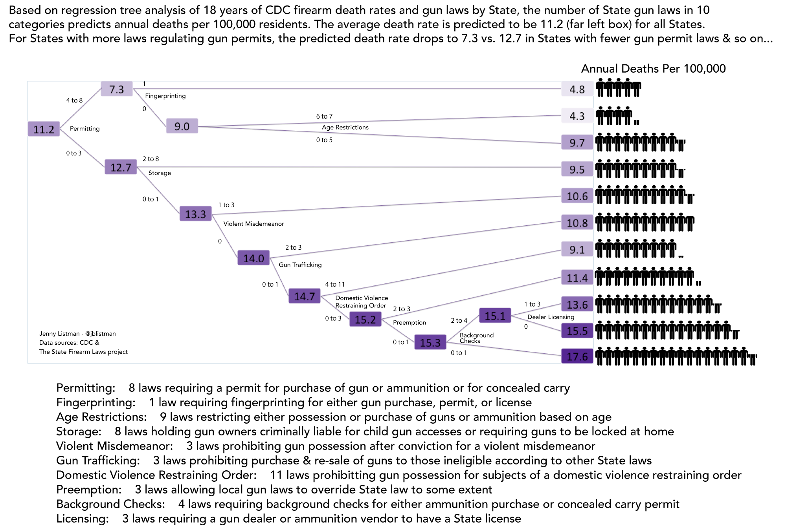

GunDeaths\_GunLaws
================
Jenny Listman
2/18/2018

#### This project uses a Recursive Partitioning And Regression Tree analysis from the `rpart` package to examine the effect of 49 gun law subcategories on annual State firearm death rates. Ten subcategories were found to significantly predict State gun death rate decreases or increases.

#### Read the blog post about it [here](https://medium.com/@jblistman) and see the readme file for the infographic.



Load packages

``` r
library(tidyverse)
library(rpart)
library(janitor)
library(stringr)
library(readxl)
library(Metrics)
library(rlist)
```

Obtain and read in datasets.

1.  Gun law data, firearm laws across US States from 1991 to 2017 downloaded from The [State Firearm Laws Project](https://www.statefirearmlaws.org/table.html) and [codebook](https://www.statefirearmlaws.org/resources)

Presense/absense of a given gun law in a state is coded as "1" or "0". These and "Year" are being read as numeric by R so will need to be changed to factor variables. State is already read as factor variable.

1.  Download CDC cause of death by State from firearms 1999 to 2016 data. On the [CDC Wonder](https://wonder.cdc.gov/ucd-icd10.html) website, sort by State, Year, and cause of injury = Firearm. This produces a file that contains the crude death rate per 100,000 state residents due to firearm per state per year. This was saved as StateGunDeathRate.csv

``` r
StateGunDeathRate <- read.csv("./data/StateGunDeathRate.csv")

gunlawdata <- read.csv("./data/gunlawdata.csv")
```

Gunlawdata contains data going back to 1991, but CDC data only goes back to 1999. Remove years up to 1999 from gunlawdata.

``` r
gunlaws <- subset(gunlawdata, year > 1998)
```

Add total for each category of gun law from codebook and create new variables. Add death rate per 100,0000 to dataframe as outcome variable.

The [codebook](https://www.statefirearmlaws.org/resources) includes each law, its category, and subcategory which have been coded by The State Firearm Laws Project research team. Some of the law categories are quite broad and the 133 individual laws may be redundant or correlated. I have used law subcategories, but also ran the same analysis using individual laws and again with categories. Subcategories perfoms about the same as when using individual laws as input but using the 14 broader categories makes less accurate predictions. Perhaps the categories (14) lose information but the subcategories (49) keep most of the information provided by the individual laws.

Counts of gun laws present per State per year must be calculated for each subcategory, but the subcategories contain different numbers of laws. Make a list of lists that contains, for each subcategory name, a list of the column names for the laws in that subcategory. These will be used to sum only the columns that fall within a given subcategory.

``` r
codebook <- as.data.frame(read_excel("./data/gunlaw_codebook.xlsx")) %>%
        .[,c(1,3,4)]

codebook$`Sub-Category` <- as.factor(codebook$`Sub-Category`)

codebook <- codebook %>%
        add_count(`Sub-Category`) %>%
        rowid_to_column() %>%
        mutate(sublevel = as.numeric(`Sub-Category`))

singles <- subset(codebook, n == 1)
single_categories <- data.frame()

for (i in 1:nrow(singles)){
        single_categories <- rbind(single_categories, singles[i,c(3,4,6)])
}

single_categories <- single_categories %>%
        mutate(mutation = paste0(`Sub-Category`,"=" ,`Variable Name` )) %>%
        .[,c(3,4)]


codenames <- list()
for (i in 1:49){
        lawnames <- as.list(subset(codebook, 
                                   sublevel == i)$`Variable Name`)
        codenames[[length(codenames)+1]] <- lawnames
}

colnames <- names(gunlaws)
```

Now add firearm death rate data to gun law data. Then, using `mutate` and `rowSums` with the `codenames` list of lists, make new variables for the total number of laws within each subcategory by State and year. Use `janitor` `clean_names` to get rid of spaces and capital letters in variable names.

``` r
gunlawsevensplit <-  gunlaws %>%
        subset(year != 2017) %>%
        merge(StateGunDeathRate[,c(1,2,6)], by.x = c("state", "year"), by.y = c("State", "Year")) %>%
        mutate(age_restrictions = rowSums(.[,colnames(.) %in% unlist(codenames[[1]])])
               ) %>%
        mutate(Alcohol = rowSums(.[,colnames(.) %in% unlist(codenames[[2]])])
               ) %>%
        mutate(`Assault weapons ban` = rowSums(.[,colnames(.) %in% unlist(codenames[[3]])])
               ) %>%
        mutate(`Background check records`=backgroundpurge) %>%
        mutate(`Background checks` = rowSums(.[,colnames(.) %in% unlist(codenames[[5]])])
               ) %>%
        mutate(`Background checks mental health records`=mentalhealth) %>%
        mutate(`Background checks state records` = rowSums(.[,colnames(.) %in% unlist(codenames[[7]])])
               ) %>%
        mutate(`Background checks through permits` = rowSums(.[,colnames(.) %in% unlist(codenames[[8]])])
               ) %>%
        mutate(`Background checks time limit`=threedaylimit) %>%
        mutate(`Bulk purchase limit`=onepermonth) %>%
        mutate(`Campus carry` = rowSums(.[,colnames(.) %in% unlist(codenames[[11]])])
               ) %>%
        mutate(`Crime gun identification`=microstamp) %>%
        mutate(Drugs=drugmisdemeanor) %>%
        mutate(Felony=felony) %>%
        mutate(Fingerprinting=fingerprint) %>%
        mutate(`Firearm removal` = rowSums(.[,colnames(.) %in% unlist(codenames[[16]])])
               ) %>%
        mutate(`Gun shows` = rowSums(.[,colnames(.) %in% unlist(codenames[[17]])])
               ) %>%
        mutate(`Gun trafficking` = rowSums(.[,colnames(.) %in% unlist(codenames[[18]])])
               ) %>%
        mutate(`Gun violence restraining orders` = rowSums(.[,colnames(.) %in% unlist(codenames[[19]])])
               ) %>%
        mutate(Immunity=immunity) %>%
        mutate(Inspections=inspection) %>%
        mutate(`Junk guns`=junkgun) %>%
        mutate(`Large capacity magazine ban` = rowSums(.[,colnames(.) %in% unlist(codenames[[23]])])
               ) %>%
        mutate(Liability=liability) %>%
        mutate(Licensing = rowSums(.[,colnames(.) %in% unlist(codenames[[25]])])
               ) %>%
        mutate(Location=residential) %>%
        mutate(`Mental Health` = rowSums(.[,colnames(.) %in% unlist(codenames[[27]])])
               ) %>%
        mutate(`Misdemeanor crimes` = rowSums(.[,colnames(.) %in% unlist(codenames[[28]])])
               ) %>%
        mutate(`Open carry` = rowSums(.[,colnames(.) %in% unlist(codenames[[29]])])
               ) %>%
        mutate(Permitting = rowSums(.[,colnames(.) %in% unlist(codenames[[30]])])
               ) %>%
        mutate(`Personalized gun technology`=personalized) %>%
        mutate(Preemption = rowSums(.[,colnames(.) %in% unlist(codenames[[32]])])
               ) %>%
        mutate(Prohibitors=ammrestrict) %>%
        mutate(Recordkeeping = rowSums(.[,colnames(.) %in% unlist(codenames[[34]])])
               ) %>%
        mutate(Registration = rowSums(.[,colnames(.) %in% unlist(codenames[[35]])])
               ) %>%
        mutate(Reporting = rowSums(.[,colnames(.) %in% unlist(codenames[[36]])])
               ) %>%
        mutate(`Restraining order` = rowSums(.[,colnames(.) %in% unlist(codenames[[37]])])
               ) %>%
        mutate(`Safety locks` = rowSums(.[,colnames(.) %in% unlist(codenames[[38]])])
               ) %>%
        mutate(`Safety training`=training) %>%
        mutate(`School zones`=elementary) %>%
        mutate(Security=security) %>%
        mutate(Stalking=stalking) %>%
        mutate(`No stand your ground`=nosyg) %>%
        mutate(Storage = rowSums(.[,colnames(.) %in% unlist(codenames[[44]])])
               ) %>%
        mutate(`Straw purchase` = rowSums(.[,colnames(.) %in% unlist(codenames[[45]])])
               ) %>%
        mutate(`Theft reporting` = rowSums(.[,colnames(.) %in% unlist(codenames[[46]])])
               ) %>%
        mutate(`Universal background checks` = rowSums(.[,colnames(.) %in% unlist(codenames[[47]])])
               ) %>%
        mutate(`Violent Misdemeanor` = rowSums(.[,colnames(.) %in% unlist(codenames[[48]])])
               ) %>%
        mutate(`Waiting period` = rowSums(.[,colnames(.) %in% unlist(codenames[[49]])])
               ) %>%
        clean_names()
```

`rpart` automatically uses a 10-fold cross validation, so we don't have to make a validation data set or add in a cross-validation step. Scale the input variables and separate the data into a train and test set. Typically, this is done by randomly selecting 20% of the data as a test set and 80% as a train set. However, for this data set, it is likely that there are correlations across States for a given year and correlations across years for a given State, or correlations among years within each small range of years. Therefore, the data set was split by odd or even year into two sets, each balanced for State and removing early/recent year bias. A repeat analysis I completed with the typical 20/80 random split gave incredibly similar results.

``` r
ml_lawsubcategories <- gunlawsevensplit[,c(1:2,137:186)] %>% 
        mutate(state_year = paste0(state, year)) %>%
        mutate_each_(funs(scale(.) %>% as.vector), vars=names(.[4:52])) 

ml_lawsubcategories_train <- subset(ml_lawsubcategories, year %in% c(1999,2001,2003,2005,2007,2009,2011,2013,2015)) %>%
        .[,-c(1,2,53)]
        
ml_lawsubcategories_test <- subset(ml_lawsubcategories, year %in% c(2000,2002,2004,2006,2008,2010,2012,2014,2016)) %>%
         .[,-c(1,2,53)]
```

Run the model and look at the results. Predict values for the test set and calculate the root mean squared error. The `Metrics` package includes a `rmse` function. Print the model and the cp (complexity parameter) table.

``` r
lawsubcategories_model <- rpart(formula = crude_rate ~ ., data = ml_lawsubcategories_train, method = "anova")

print(lawsubcategories_model)
printcp(lawsubcategories_model)

lawsubcategories_pred <- predict(object = lawsubcategories_model,
                         newdata = ml_lawsubcategories_test)

rmse_subcategories <- rmse(actual = ml_lawsubcategories_test$crude_rate, 
     predicted = lawsubcategories_pred)

rmse_subcategories
```

Prune the tree to find the optimal model that avoids overfitting. It turns out to be the same as the above model.

``` r
opt_index <- which.min(lawsubcategories_model$cptable[, "xerror"])
cp_opt <- lawsubcategories_model$cptable[opt_index, "CP"]

lawsubcategories_model_opt <- prune(tree = lawsubcategories_model, 
                         cp = cp_opt)
print(lawsubcategories_model_opt)                          
plot(lawsubcategories_model_opt)
text(lawsubcategories_model_opt, use.n=TRUE, all=TRUE, cex = 0.5)
```

We need to translate the z-scored values back to the original values they represent in order to make an infographic. The options in `rpart` `visNetwork` and `networkD3` didn't produce the exact tree that I wanted or didn't have the editing options I was looking for; the z-scores are now completely separated from original values, but z-scores don't tell us anything useful at this point.

I saved the z-scored version of the test set with another name: `z_scored_test_data`. I sometimes make long-ish variable names to dummy-proof things for myself. Create a version of the test dataset without z-scores. Then create a decoder that is a list of dataframes, one dataframe for each law subcategory. Each dataframe in the list contains one column of z-sores and one column of original values (total count of laws in a given subcategory) for each law subcategory. Use `list.save` from the `rlist` package to save the output to a file. The decoder, `zscore_decoder.rds`, can be found in the data file of the associated [GitHub repository](https://github.com/JListman/FirearmDeathRate).

``` r
z_scored_test_data <- ml_lawsubcategories_test

no_z_scores <- gunlawsevensplit[,c(1:2,137:186)] %>% 
        subset(year %in% c(2000,2002,2004,2006,2008,2010,2012,2014,2016)) %>%
         .[,-c(1,2)]

names <- names(cbind(no_z_scores, z_scored_test_data))

z_score_codes <- cbind(no_z_scores, z_scored_test_data) %>%
        .[ , order(names)] %>%
        .[,-c(25,26)]  

names2 <- names(z_score_codes)

z_score_codes <- z_score_codes %>%
        mutate_each_(funs(as.character(.)), names2) %>%
        mutate_each_(funs(as.factor(.)), names2)

decoder <- list()
j = 1
k = 2

for (i in 1:49){decoder[[i]] <- unique(z_score_codes[,c(j, k)])
j = j+2
k = k+2
}

list.save(decoder, "zscore_decoder.rds")
```
